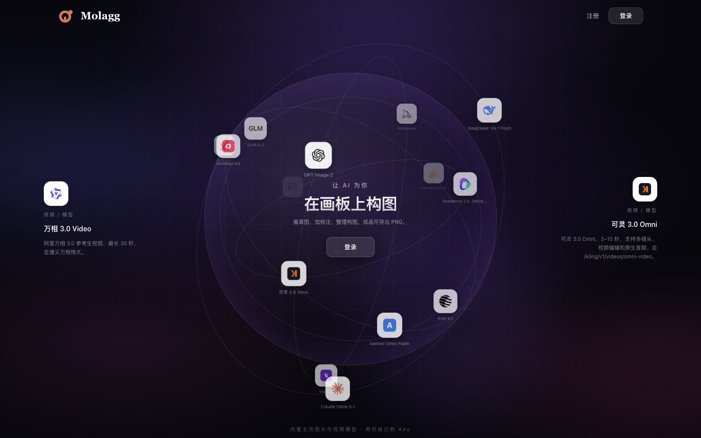
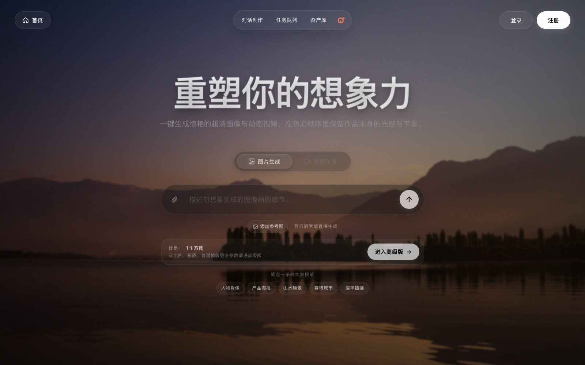

<p align="center">
  <a href="README.md">中文</a>
</p>

<p align="center">
  
</p>

<h1 align="center">Molagg</h1>

<p align="center">
  An AI creation workbench built around video: make clips one at a time on the create page, or wire a whole pipeline on the canvas and run it in batches.
</p>

<p align="center">
  
  
  
  
</p>

---

## 🖼️ Screenshots

**Sign-in page**: a dotted globe showing the built-in image and video models.



**Home**: one sentence to an image or a video, with sample prompts to try.



## ✨ Features

Side nav, top to bottom: Library, Create (image / video / chat), Canvas, Task queue, Tutorial. On phones it becomes a bottom tab bar.

| Area | What it does |
| --- | --- |
| Home | Quick image or video from one sentence |
| Create | Video only, in two modes: first/last frame, and reference |
| Canvas | Chain text, image and video nodes into a flow and run it in order |
| Chat | Generate images and scripts by chatting, or run a full character → storyboard → video flow |
| Task queue | Progress, failure reasons, download, retry, "make similar" for every job |
| Library | All works and uploaded materials, organised by project |
| Tutorial | How to write prompts and what to change when a result is off |

The UI follows the system light / dark setting and supports Chinese and English.

### Create page (video)

| Mode | Use it when | You provide |
| --- | --- | --- |
| First / last frame | The opening and closing shots must look a certain way | First frame + last frame + prompt |
| Reference | A person, animal, product or scene must stay consistent | Reference image / video / audio + prompt |

- Generate a frame straight into a first/last-frame slot.
- Director assistant turns a rough idea into a detailed prompt.
- Each mode shows 4 real 30-second sample clips; clicking one fills in its prompt and ratio.
- Switching models never drops uploaded materials; unsupported materials are reported when you press generate.

### Canvas

- Left panel tabs: Build (nodes and workflow presets), Assistant (chat to create, connect and edit nodes), Assets (workflow templates, past works, generation log), Versions (snapshots, diff, restore).
- Cascade run: runs every generator in dependency order, batch by batch, after a preflight check and a confirmation showing the task count and estimated cost; stops if a batch fails.
- Tidy layout, groups (⌘G), collapse / expand, snap to grid, alignment guides, minimap, ⌘K search.
- JSON import / export / merge, PNG export of the whole canvas. Autosaved to the backend.
- The assistant only builds the canvas. It never starts a paid generation; a person always presses that button.

## 🔑 First run: add your keys

Sign up (email + password of at least 8 characters). The first account is the admin; every later account has its own data. Then open **System settings → Image/Video** and fill in the API key for:

| Channel | Used for | Base URL (pre-filled) |
| --- | --- | --- |
| GPT Image | Images | `https://api.opusapi.xyz` |
| Molagg Video | Videos | `https://molagg.com` |

Keys are stored encrypted under your own account. Other built-in channels (Doubao, Wanx, Kling, Sora, Veo, Hailuo, Vidu, NanoBanana, Midjourney, Qwen) work once you add your own base URL and key.

## 💰 Pricing

Prices are shown before generating, only when you are connected to these relays:

| Item | Relay | Price |
| --- | --- | --- |
| Image · standard | opusapi.xyz | ¥0.4 each |
| Image · realistic+ | opusapi.xyz | ¥0.8 each |
| Video · Seedance 2.5 (30 s) | molagg.com | ¥6 per clip |

## 🚀 Quick start

```bash
npm install
cd frontend && npm install && cd ..
cp .env.example .env          # set APP_ENCRYPTION_KEY to a long random string, and never change it afterwards
npm run prisma:generate
npm run prisma:init
npm run dev:all               # frontend http://localhost:5173, API http://localhost:3000/api
```

Production: `npm run build:all && npm run start:all` (frontend on `http://localhost:3001`). Docker: `docker compose up -d --build`.

FFmpeg is only needed for merging storyboard clips.

Reference mode sends reference image URLs upstream, so they must be publicly reachable. When running locally, Molagg is not offered in reference mode; it becomes available once the site is deployed on a public domain.

Offline checks: `cd frontend && npm run checks`.

## 🙏 Credits

Molagg is built on the open-source project [FlowMuseGallery](https://github.com/hjxwz123/FlowMuseGallery).

## 📄 License

MIT, see [LICENSE](LICENSE).
