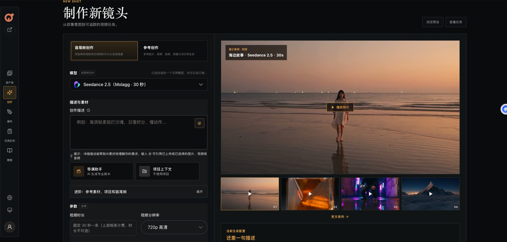
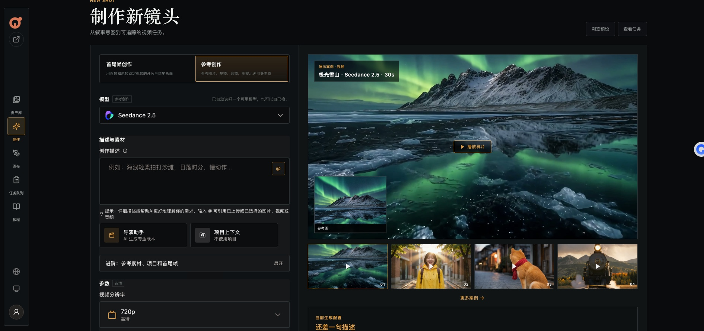
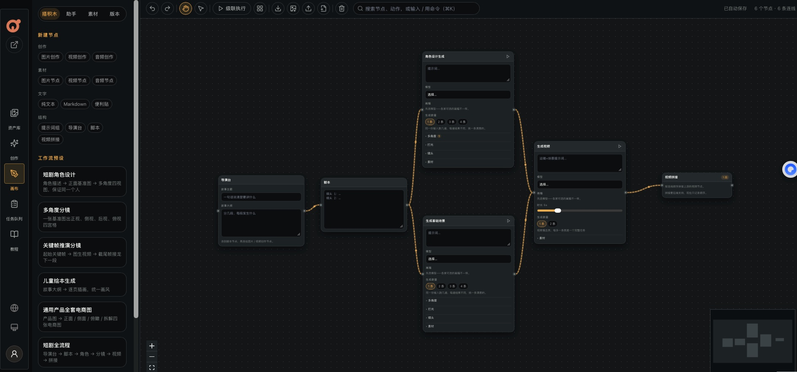

<p align="center">
  <a href="README.en.md">English</a>
</p>

<p align="center">
  
</p>

<h1 align="center">Molagg</h1>

<p align="center">
  围绕视频的 AI 创作工作台：创作页一条一条出视频，画布把整套流程搭起来批量跑。
</p>

<p align="center">
  
  
  
  
</p>

<p align="center">
  <a href="#-界面预览">界面预览</a>
  ·
  <a href="#-功能">功能</a>
  ·
  <a href="#-第一次使用填-key">第一次使用</a>
  ·
  <a href="#-价格">价格</a>
  ·
  <a href="#-快速开始">快速开始</a>
</p>

---

## 🖼️ 界面预览

**创作页 · 首尾帧创作**：用首帧和尾帧锁定视频的开头和结尾。右边是真实生成的 30 秒样片，点一下就把它的提示词和比例带到左边。



**创作页 · 参考创作**：上传参考图片 / 视频 / 音频，让人物、动物、场景在视频里保持一致。样片左下角是当时用的参考图。



**画布**：把导演台、脚本、角色设计、场景、生成视频、视频拼接连成一条流程，点「级联执行」按顺序跑完。图里是「短剧全流程」预设。



**首页**：一句话出图或出视频，没思路可以点下面的样本。


**登录页**：模型点阵地球，展示内置的图片和视频模型。


## ✨ 功能

左侧导航从上到下：资产库、创作（创作图片 / 创作视频 / 对话创作）、画布、任务队列、教程。手机上变成底部标签栏。

| 板块 | 一句话说明 |
| --- | --- |
| 首页 | 一句话快速出图或出视频，适合随手试试 |
| 创作页 | 专门出视频，分「首尾帧创作」和「参考创作」 |
| 画布 | 把文字、出图、出视频连成流程，一键按顺序跑完 |
| 对话创作 | 跟 AI 聊着出图、写脚本，或全自动串联角色 / 分镜 / 视频 |
| 任务队列 | 所有生成任务的进度、失败原因、下载、重试、做同款 |
| 资产库 | 所有作品和上传的素材，按项目分文件夹 |
| 教程 | 怎么写提示词、结果不对先改哪里 |

界面默认跟随系统浅色 / 深色，支持中文 / English。

### 首页

- 选「图片生成」或「视频生成」，写一句描述就能出。可以粘贴或上传参考图。
- 图片可选 1–4 张；用 GPT Image 时可选比例（1:1 / 3:2 / 2:3），连 opusapi 时还能选「通用」或「写实增强」。
- 视频选 Molagg 时固定 30 秒一条。
- 价格直接写在生成框下面。结果出现在输入框下方。

### 创作页（视频）

| 模式 | 适合做什么 | 要准备什么 |
| --- | --- | --- |
| 首尾帧创作 | 开头和结尾画面必须是指定的样子 | 首帧图 + 尾帧图，再写提示词 |
| 参考创作 | 让人物、动物、产品或场景在视频里保持一致 | 参考图片 / 视频 / 音频 + 提示词 |

- 首尾帧槽位里可以直接「生成这一帧」，出好的图自动放进去。
- 「导演助手」：填想法、主体、场景、动作，选风格、镜头、节奏，AI 帮你写成专业提示词。
- 右侧每个模式有 4 条真实生成的 30 秒样片，点一下就把它的提示词和比例带到左边。
- 换模型时已上传的素材不会被清掉；模型不支持某个素材时，点生成会直接提示。

### 画布

把「写脚本 → 出分镜图 → 每张图生成视频」这样的整套流程搭起来一次跑完。连线表示把前一个节点的内容交给后一个。

- **左侧栏 4 个标签**：搭积木（新建节点、工作流预设）、助手（用对话让 AI 帮你建节点、连线、改参数）、素材（工作流模板、以前生成的作品、生成日志）、版本（存快照、对比、一键恢复）。
- **级联执行**：按连线先后一批批跑完所有生成节点。开始前先检查，再弹窗写明要提交几个任务、预计花多少钱，确认后才跑；某一批失败，后面的自动停下。
- **视图**：整理画布、按功能成组（⌘G）、折叠 / 展开、网格吸附、对齐参考线、小地图、⌘K 搜索节点。
- **导入导出**：JSON 备份 / 合并、导出整张画布为 PNG。
- 画布自动保存到后端，关掉页面再打开还在。
- 助手只会搭画布，**不会替你点生成**。每一次真正花钱的生成都要人来按。

### 任务队列

- 顶部统计进行中 / 已完成 / 失败 / 全部，点一下就筛出这一类；可按提示词、图片 / 视频、项目筛选。
- 每条任务显示状态、大概进度和剩余时间，失败会写明原因。
- 详情里能复制提示词、打开原文件、下载、重试（图片可换模型）、删除；GPT Image 的图还能「编辑图片」。

### 资产库和项目

- 按项目分文件夹，切换「作品 / 素材」，按类型筛选、按提示词搜索、上传素材。
- 每件作品都能「做同款」，把提示词、模型和参数带到创作页。
- 项目里可以写描述、整理素材，在「灵感与分镜提示词」里写剧情让 AI 生成分镜提示词。

### 对话创作

需要先在「系统设置 → 对话模型」配好对话模型。

| 模式 | 做什么 |
| --- | --- |
| Agent 模式 | 说一句话、带上参考图，AI 直接出图 |
| 全自动模式 | 选好项目和模型，AI 按「角色 → 分镜 → 视频」一路做下来 |
| 聊天模式 | 写脚本、写提示词、问问题 |

对话里可以上传图片和文档（txt / md / csv / json / html / pdf / docx / pptx / xlsx，单条最多 5 个、每个 20MB 以内）。

## 🔑 第一次使用：填 Key

1. 注册账号（邮箱 + 至少 8 位密码）。第一个注册的账号是管理员；之后每个人的数据互相独立。
2. 左下角用户菜单 →「系统设置」→「图片/视频」标签。
3. 在下面两个渠道里填 API Key，Base URL 已经默认填好：

| 渠道 | 用途 | Base URL |
| --- | --- | --- |
| GPT Image | 出图 | `https://api.opusapi.xyz` |
| Molagg 视频 | 出视频 | `https://molagg.com` |

4. 点「测试连接」，再点「保存」，卡片显示「已接入」就好了。

Key 加密保存在你自己的账号下。其他渠道（豆包、万相、可灵、Sora、Veo、海螺、Vidu、NanoBanana、Midjourney、通义千问）也内置了，填上自己的 Base URL 和 Key 就能用。

## 💰 价格

只有连的是下面两个中转站时，界面上才会在生成前显示价格。

| 内容 | 中转站 | 价格 |
| --- | --- | --- |
| 图片 · 通用 | opusapi.xyz | ¥0.4 / 张 |
| 图片 · 写实增强 | opusapi.xyz | ¥0.8 / 张 |
| 视频 · Seedance 2.5（30 秒） | molagg.com | ¥6 / 条 |

一条 30 秒视频一般要 10–30 分钟。上游明确失败会自动退款。

## 🚀 快速开始

### 1. 安装依赖

```bash
npm install
cd frontend && npm install
cd ..
```

需要合并分镜视频时，还要装 FFmpeg（macOS：`brew install ffmpeg`；Ubuntu：`sudo apt install ffmpeg`）。

### 2. 配置环境变量

```bash
cp .env.example .env
```

```env
DATABASE_URL="file:./data/flowmuse.sqlite"
PORT=3000
FRONTEND_PORT=3001
BACKEND_URL="http://127.0.0.1:3000"
APP_PUBLIC_URL="http://localhost:3000"
FRONTEND_URL="http://localhost:5173"
APP_ENCRYPTION_KEY="change-me-32-bytes-minimum-length"
```

> `APP_ENCRYPTION_KEY` 用来加密保存 API Key。第一次运行前换成自己的长随机字符串，之后不要再改，否则已存的 Key 解不开。

### 3. 初始化数据库

```bash
npm run prisma:generate
npm run prisma:init
```

### 4. 启动

开发：

```bash
npm run dev:all        # 前端 http://localhost:5173，后端 http://localhost:3000/api
```

生产：

```bash
npm run build:all
npm run start:all      # 前端 http://localhost:3001
```

Docker：

```bash
docker compose up -d --build
```

### 数据放在哪

| 内容 | 位置 |
| --- | --- |
| 数据库 | `prisma/data/flowmuse.sqlite`（Docker：`./data/sqlite`） |
| 生成结果和上传文件 | `uploads/`（Docker：`./data/uploads`） |

参考创作需要把参考图地址发给上游，上游要能从公网打开。所以本机运行时，Molagg 暂时不在参考创作里；部署到有域名的服务器后再开放。

## 🧰 常用命令

```bash
npm run dev:all
npm run build:all
npm run start:all
cd frontend && npm run type-check
cd frontend && npm run checks   # 离线自测，不需要浏览器和真实渠道
```

## 📁 目录结构

```text
frontend/                          React + Vite 前端
frontend/src/components/features/  各页面：home / create / canvas-v2 / tasks / chat ...
frontend/public/showcase/          创作页展示样片
prisma/                            数据库结构、默认渠道和模型
src/                               NestJS 后端
src/adapters/                      各家模型的接口适配
src/canvas/                        画布保存、版本快照、模板
src/chat/                          对话、文件解析、自动工作流
src/images/  src/videos/           图片 / 视频任务
src/projects/                      项目与素材
src/local-runner/                  本地任务执行器
docs/                              开发记录和交接文档
```

## 🙏 致谢

Molagg 基于开源项目 [FlowMuseGallery](https://github.com/hjxwz123/FlowMuseGallery) 改造。

## 📄 License

MIT，见 [LICENSE](LICENSE)。
